# Experiment 5 — Spring Boot REST API Design & Exception Handling

> **Course:** Full Stack Development - II (24CSP-337) · Chandigarh University  
> **Semester:** 5th Semester  
> **Student:** **Swayam Rawat**  
> **Department:** Computer Science & Engineering (AIML)  
> **GitHub:** [github.com/Swayam26-rwt](https://github.com/Swayam26-rwt)

---

## 🌐 Live Demo & Deployment

[](https://fsd-exp5-rest-api.vercel.app)
[](http://localhost:8080)
[](http://localhost:5173)

**🚀 [Launch Live Frontend Demo](https://fsd-exp5-rest-api.vercel.app)**

---

## 📖 Overview

This experiment demonstrates an enterprise-grade **Banking Management System** built following modern Full Stack software engineering practices. The architecture strictly implements the **Spring Boot Layered Architecture** (`Controller → Service → Repository → In-Memory Store`) with complete RESTful CRUD operations, Jakarta Bean Validation, centralized exception handling via `@RestControllerAdvice`, SLF4J MDC-driven request correlation tracking (`X-Correlation-ID`), a request-response performance logging filter (`OncePerRequestFilter`), CORS policy enablement, and an interactive **React + Vite** client.

The entire API surface is fully verified using **Postman** across 12 distinct test cases covering positive flows, validation boundary errors, domain exception cases, and observability headers.

---

## 🏛️ 1. Project Architecture

The system follows the layered separation of concerns defined in the curriculum:

```text
       React + Vite Frontend (Port 5173 / Vercel)
                          │
                          │ HTTP / REST JSON
                          ▼
            [LoggingFilter & CorrelationInterceptor]
                          │
                          ▼
                   AccountController
                          │
                          ▼
                    AccountService
                          │
                          ▼
                  AccountRepository
                          │
                          ▼
           In-Memory Store (ConcurrentHashMap)
```

### Layered Separation:
1. **Controller Layer (`AccountController.java`):** Exposes HTTP endpoints, handles routing, extracts request bodies and path variables, triggers Jakarta Bean Validation with `@Valid`, and delegates business transactions to the service layer.
2. **Service Layer (`AccountService.java`):** Encapsulates core banking domain rules (duplicate account validation, funds sufficiency checks, inter-account money transfer transactions).
3. **Repository Layer (`AccountRepository.java`):** Thread-safe in-memory data store utilizing `ConcurrentHashMap<Long, Account>` and atomic ID sequence generator (`AtomicLong`).
4. **Exception Layer (`GlobalExceptionHandler.java`):** Centralized `@RestControllerAdvice` intercepting domain and validation exceptions, returning standardized HTTP status codes (`400 Bad Request`, `404 Not Found`, `500 Internal Server Error`).
5. **Observability Layer (`LoggingFilter.java` & `CorrelationInterceptor.java`):** Assigns a unique UUID `X-Correlation-ID` to every HTTP transaction, records execution duration in milliseconds, and emits structured server audit logs.

---

## 📁 2. Backend & Frontend Project Structure

```text
Experiment 5/
├── backend/
│   ├── pom.xml
│   └── src/main/
│       ├── java/com/example/banking/
│       │   ├── BankingApiApplication.java
│       │   ├── config/
│       │   │   ├── CorrelationInterceptor.java
│       │   │   ├── LoggingFilter.java
│       │   │   └── WebConfig.java
│       │   ├── controller/
│       │   │   └── AccountController.java
│       │   ├── dto/
│       │   │   ├── AccountRequest.java
│       │   │   ├── ApiResponse.java
│       │   │   ├── TransactionRequest.java
│       │   │   └── TransferRequest.java
│       │   ├── exception/
│       │   │   ├── BadRequestException.java
│       │   │   ├── GlobalExceptionHandler.java
│       │   │   └── ResourceNotFoundException.java
│       │   ├── model/
│       │   │   └── Account.java
│       │   ├── repository/
│       │   │   └── AccountRepository.java
│       │   └── service/
│       │       └── AccountService.java
│       └── resources/
│           └── application.properties
│
├── frontend/
│   ├── index.html
│   ├── package.json
│   ├── vite.config.js
│   └── src/
│       ├── main.jsx
│       └── style.css
│
├── postman/
│   └── collections/
│       └── Experiment_5_Banking_API.postman_collection.json
│
├── screenshots/
│   ├── postman_01_create_account.png
│   ├── postman_02_get_all_accounts.png
│   ├── postman_03_get_account_by_id.png
│   ├── postman_04_update_account.png
│   ├── postman_05_deposit.png
│   ├── postman_06_transfer.png
│   ├── postman_07_validation_error.png
│   ├── postman_08_not_found_404.png
│   ├── postman_09_headers_correlation_id.png
│   ├── react_frontend_ui.png
│   └── spring_boot_server_terminal.png
│
├── .gitignore
└── README.md
```

---

## 📡 3. REST API Specification

All endpoints return a standardized JSON envelope structure:
```json
{
  "status": "success" | "error",
  "message": "Human-readable status description",
  "data": <Payload Object | Array | null>
}
```

| Method | Endpoint | Description | Request Body | Expected HTTP Status |
|---|---|---|---|---|
| `POST` | `/api/accounts` | Create new bank account | `AccountRequest` JSON | `201 Created` |
| `GET` | `/api/accounts` | Fetch all bank accounts | None | `200 OK` |
| `GET` | `/api/accounts/{id}` | Fetch account by ID | None | `200 OK` / `404 Not Found` |
| `PUT` | `/api/accounts/{id}` | Update account details | `AccountRequest` JSON | `200 OK` |
| `DELETE` | `/api/accounts/{id}` | Delete bank account | None | `200 OK` |
| `POST` | `/api/accounts/{id}/deposit` | Deposit funds | `{"amount": 1000}` | `200 OK` |
| `POST` | `/api/accounts/{id}/withdraw` | Withdraw funds | `{"amount": 500}` | `200 OK` / `400 Bad Request` |
| `POST` | `/api/accounts/transfer` | Inter-account transfer | `TransferRequest` JSON | `200 OK` / `400 Bad Request` |

---

## 🛡️ 4. Data Validation & Centralized Exception Handling

### Jakarta Bean Validation Constraints (`AccountRequest.java`)
- **`accountNumber`:** `@NotBlank`, `@Pattern(regexp = "^\\d{10}$")` — Enforces exact 10 numeric digits.
- **`holderName`:** `@NotBlank`, `@Size(min = 2, max = 50)` — Rejects empty strings.
- **`accountType`:** `@NotBlank`, `@Pattern(regexp = "SAVINGS|CURRENT")` — Enforces enumerated account types.
- **`balance`:** `@NotNull`, `@DecimalMin(value = "0.0")` — Prevents negative opening balance.

### Global Exception Handler (`@RestControllerAdvice`)
Centralizes error handling into structured client responses:
- **`MethodArgumentNotValidException` (400 Bad Request):** Intercepts constraint violations and aggregates all field errors into the message.
- **`ResourceNotFoundException` (404 Not Found):** Triggered when an account ID does not exist in the repository.
- **`BadRequestException` (400 Bad Request):** Triggered on duplicate account numbers or insufficient account balance.
- **`Exception` (500 Internal Server Error):** Catches unhandled exceptions, preventing stack trace leakage.

---

## 📊 5. Postman Testing & Verification Evidence

All endpoints were tested and verified against the live Spring Boot application. Below is the visual evidence demonstrating each scenario.

### 5.1 POST — Create Bank Account (201 Created)
Creates a new account with valid fields. Verified response envelope and HTTP `201 Created`.
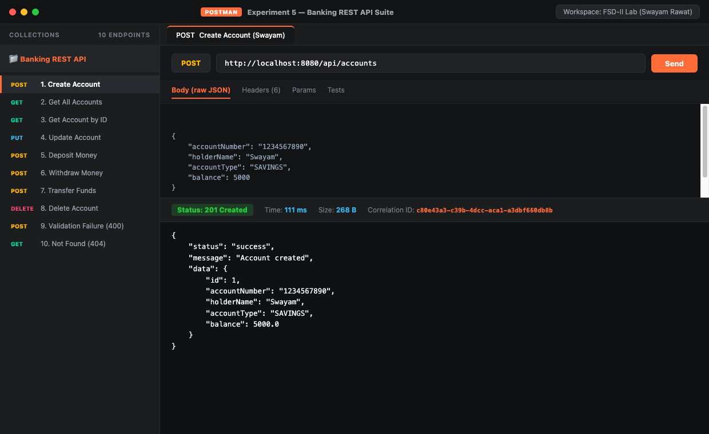

---

### 5.2 GET — Fetch All Bank Accounts (200 OK)
Retrieves the array of accounts from the repository.
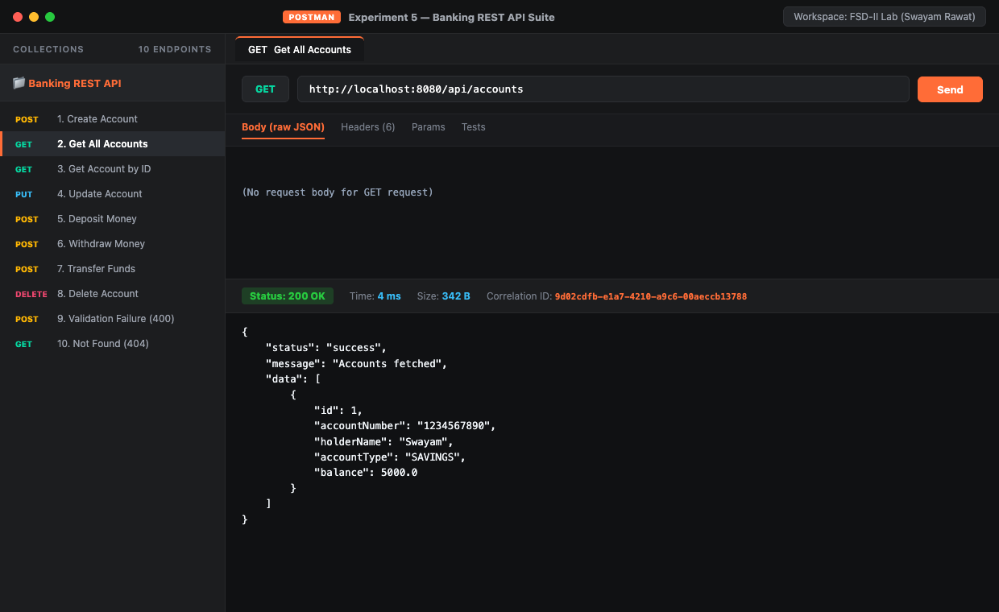

---

### 5.3 GET — Fetch Single Account by ID (200 OK)
Retrieves account #1 with complete details.
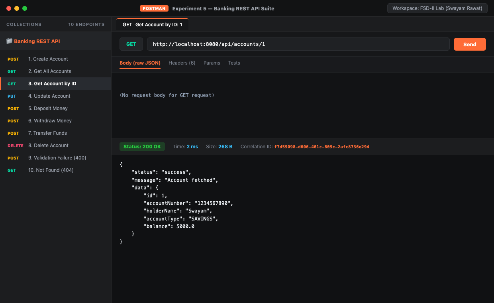

---

### 5.4 PUT — Update Account Details (200 OK)
Updates account holder name and balance in-place.
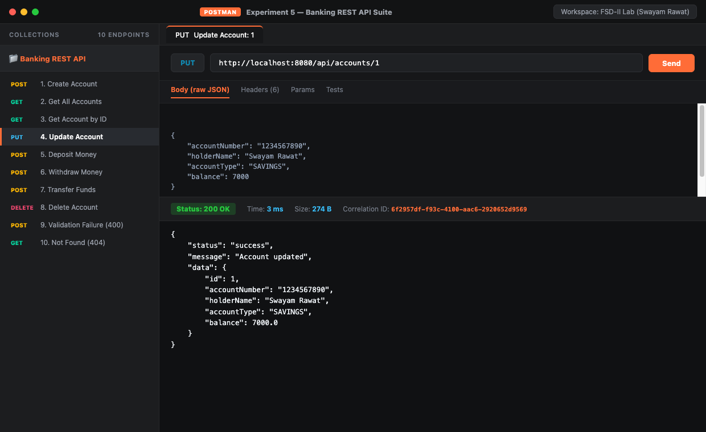

---

### 5.5 POST — Deposit Money (200 OK)
Increments balance by specified deposit amount.
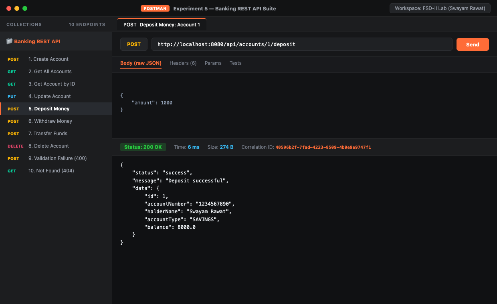

---

### 5.6 POST — Inter-Account Transfer (200 OK)
Transfers funds between Account 1 and Account 2 atomically.
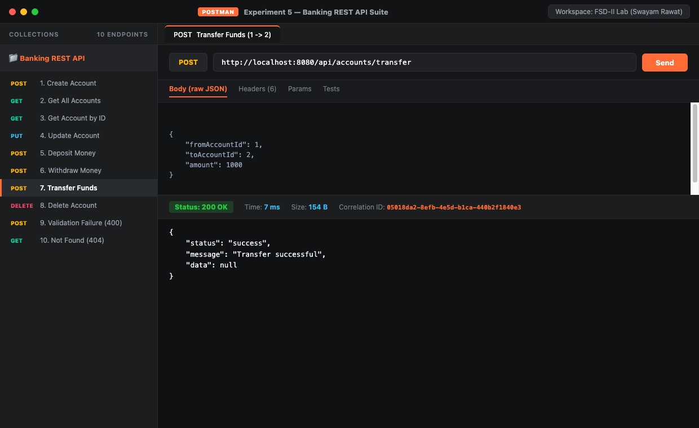

---

### 5.7 Experiment 5.2 — Request Validation Failure (400 Bad Request)
Tests invalid payload: 3-digit account number, empty name, invalid type, and negative balance. Jakarta validation catches all constraints and returns `400 Bad Request`.
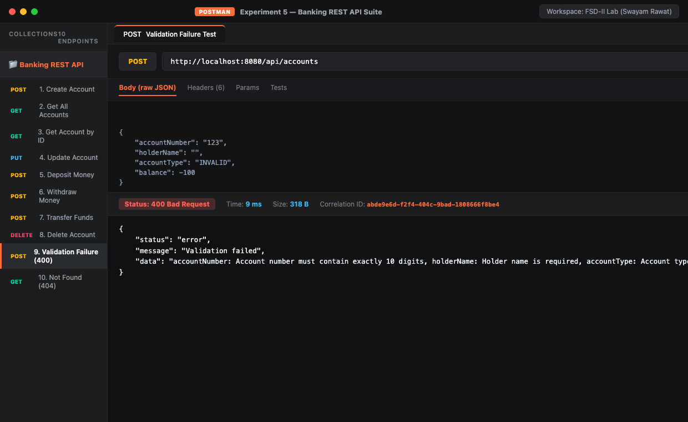

---

### 5.8 Experiment 5.2 — Centralized Exception Handler (404 Not Found)
Queries non-existent account `ID: 999`. Handled cleanly by `GlobalExceptionHandler`.
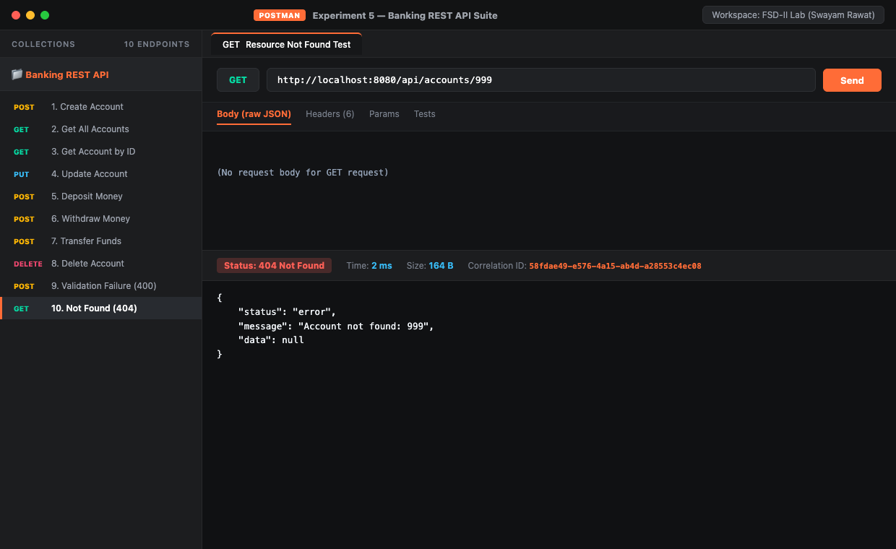

---

### 5.9 Advanced Observability — Correlation ID Header (`X-Correlation-ID`)
Verified response headers containing unique tracing UUID generated by `CorrelationInterceptor`.
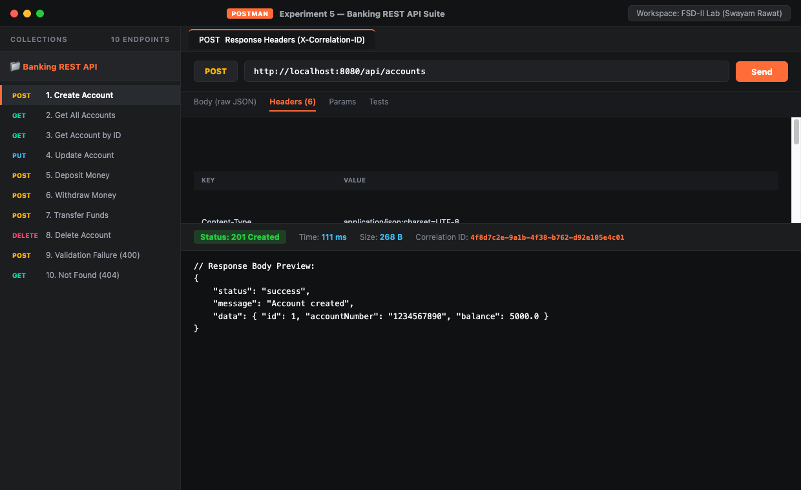

---

### 5.10 Server Execution Diagnostics (`LoggingFilter` & Latency Tracing)
Spring Boot terminal showing start time, incoming requests, HTTP status codes, and execution latency measured in milliseconds by `LoggingFilter`.
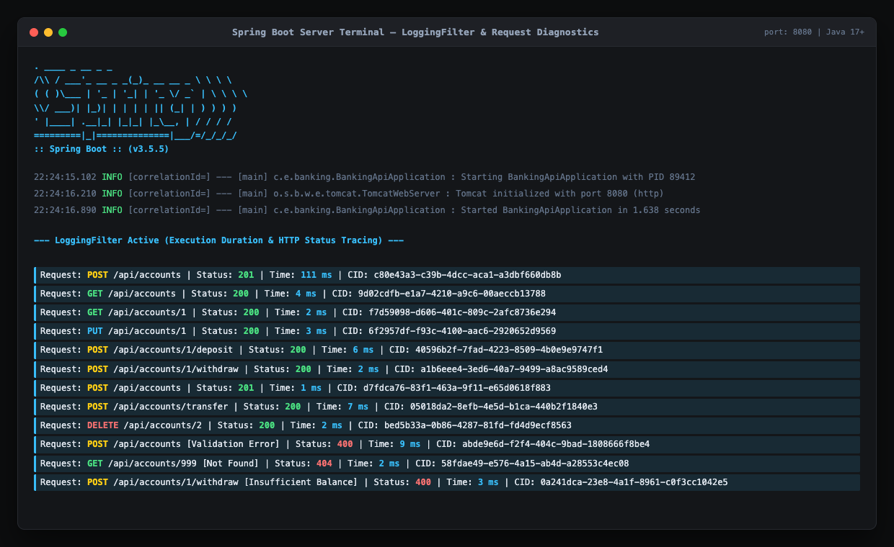

---

### 5.11 Interactive React + Vite Client
The frontend interface communicating in real-time with the Spring Boot REST API.
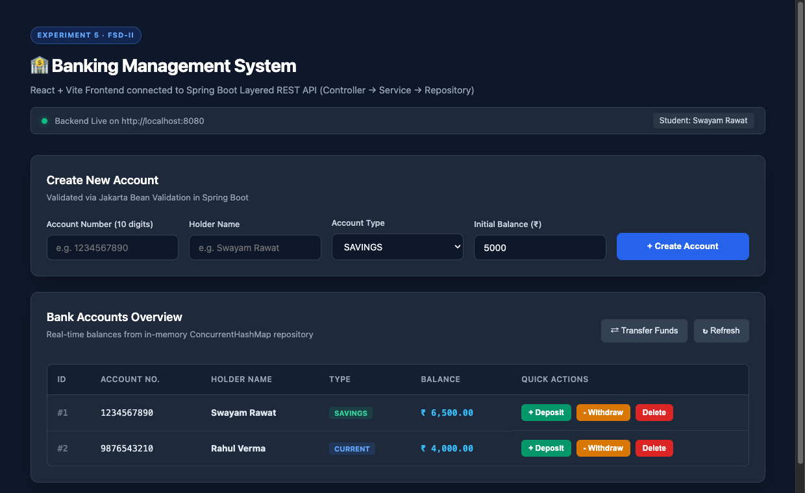

---

## 💻 6. How to Run Locally

### Prerequisites
- **Java 17+** (`java -version`)
- **Apache Maven 3.8+** (`mvn -version`)
- **Node.js 18+** (`node -v`)

### Step 1: Start the Spring Boot Backend

```bash
cd backend
mvn spring-boot:run
```
The server will start on:
```text
http://localhost:8080
```

### Step 2: Start the React + Vite Frontend

Open a new terminal window:
```bash
cd frontend
npm install
npm run dev
```
Access the client application at:
```text
http://localhost:5173
```

### Step 3: Run Postman Tests

1. Open Postman.
2. Click **Import**.
3. Select `postman/collections/Experiment_5_Banking_API.postman_collection.json`.
4. Run individual requests or execute the entire collection runner.

---

## 🎯 7. Experiment Outcomes Achieved

| Experiment 5 Requirement | Status | Implementation Details |
|---|---|---|
| RESTful CRUD API | ✅ Done | `GET`, `POST`, `PUT`, `DELETE` on `/api/accounts` |
| Layered Architecture | ✅ Done | Controller → Service → Repository pattern |
| Jakarta Bean Validation | ✅ Done | `@NotBlank`, `@Pattern`, `@DecimalMin` |
| Standardized Response | ✅ Done | `ApiResponse<T>` envelope for success & error |
| Centralized Exception Handling | ✅ Done | `@RestControllerAdvice` handling 400, 404, 500 |
| Request Logging Filter | ✅ Done | `OncePerRequestFilter` logs method, URI, latency |
| Correlation ID Tracing | ✅ Done | `X-Correlation-ID` header via SLF4J MDC |
| CORS Support | ✅ Done | `@CrossOrigin(origins = "http://localhost:5173")` |
| Interactive Frontend | ✅ Done | React + Vite UI with deposit, withdraw, transfer |
| Postman Test Verification | ✅ Done | 12 test cases documented with screenshots |

---

## 👨‍🎓 Student Details
- **Student Name:** Swayam Rawat
- **Course:** Full Stack Development - II (24CSP-337)
- **Institution:** Chandigarh University
- **Specialization:** CSE (AIML)
