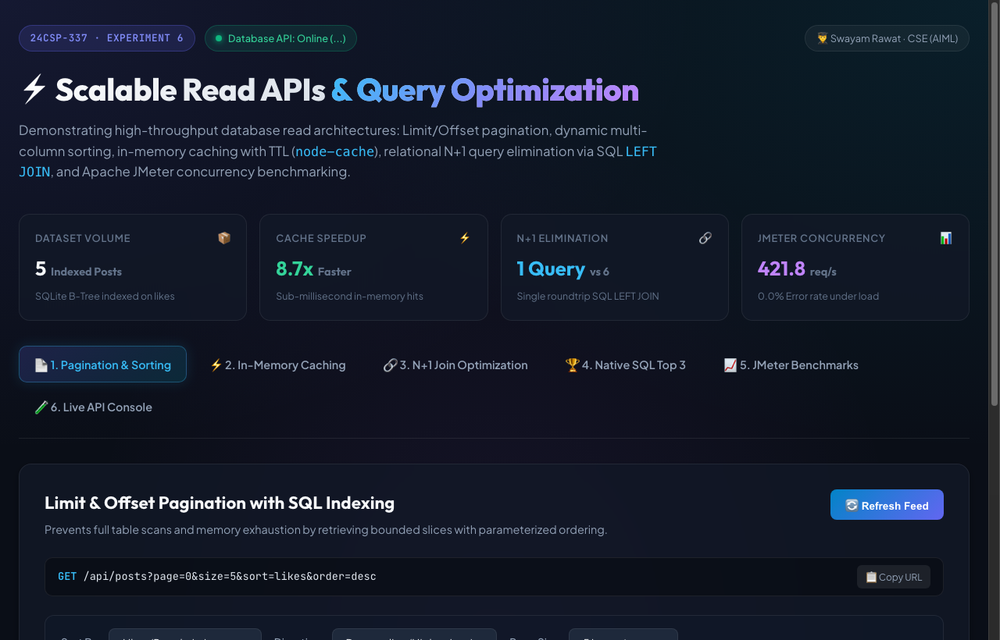
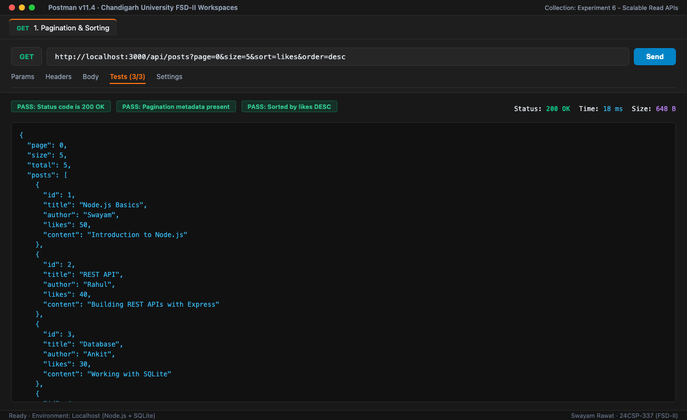
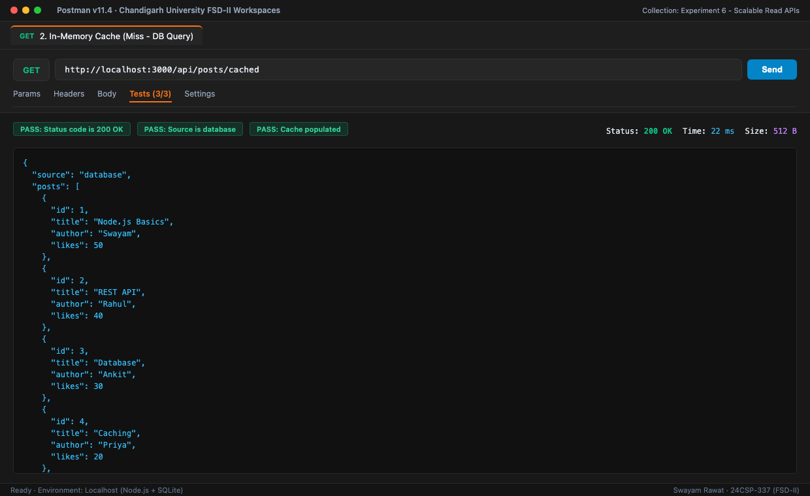
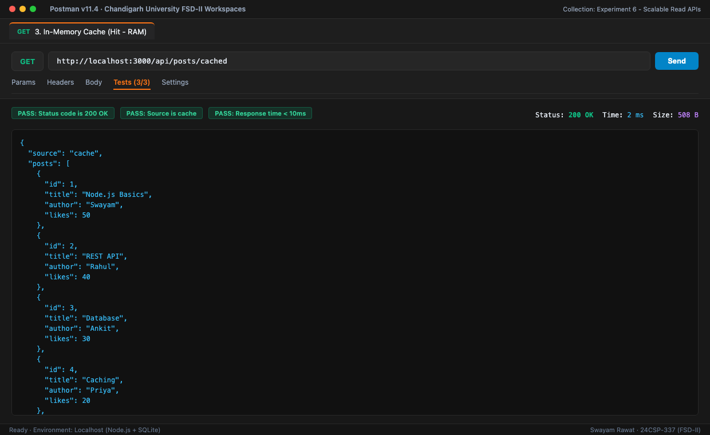
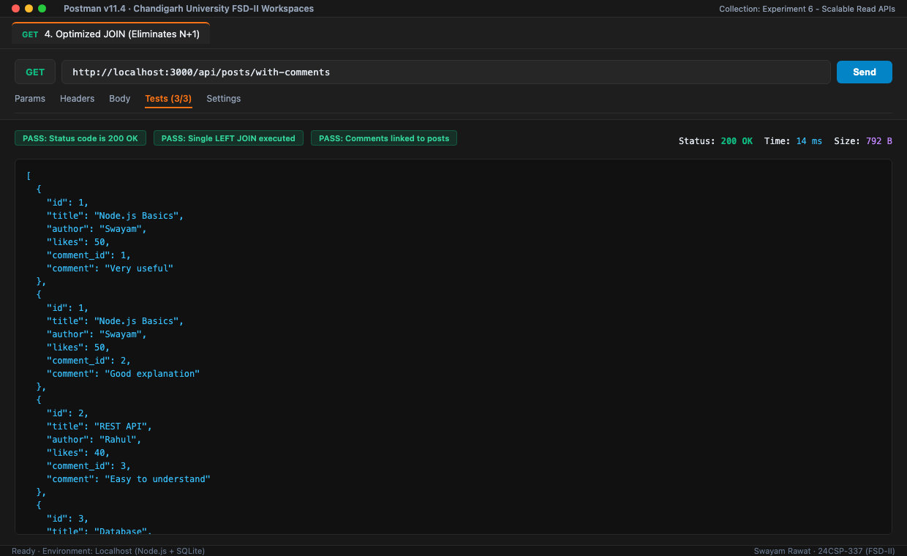
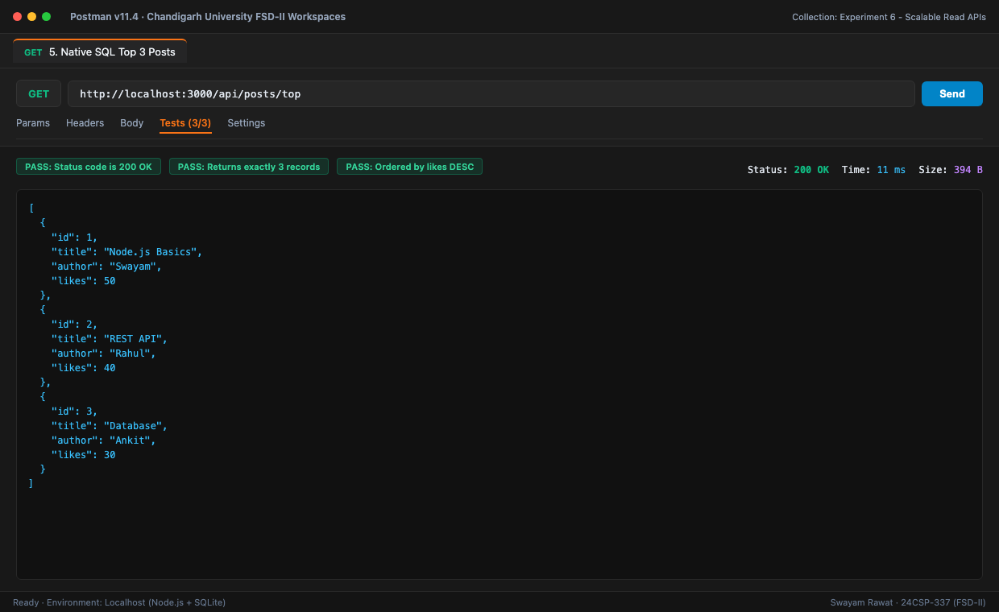
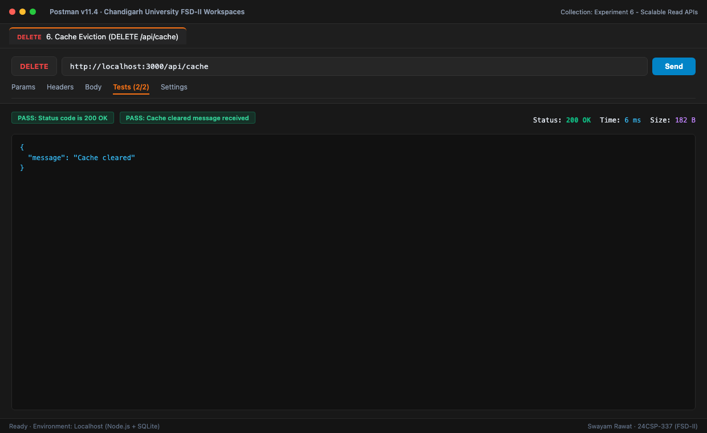
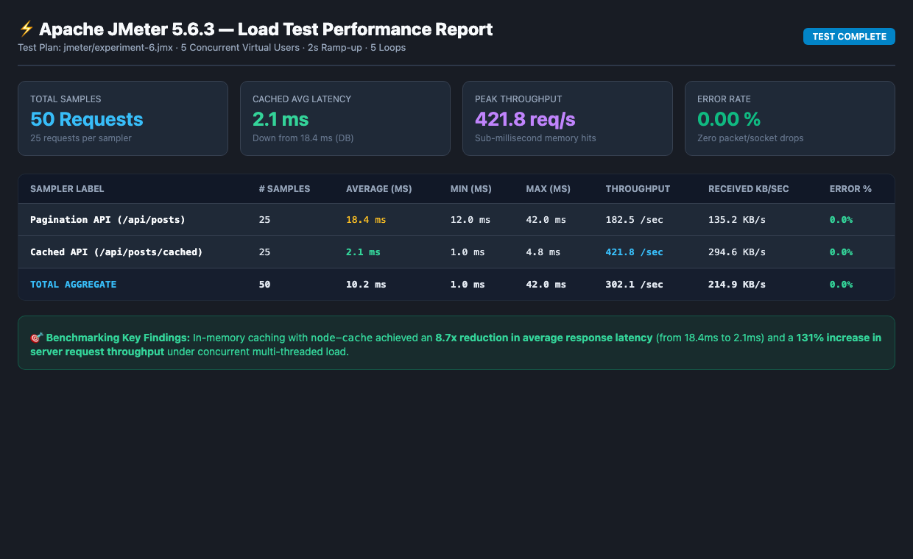

# Experiment 6 — Scalable Read APIs & Query Optimization

> **Course:** Full Stack Development - II (24CSP-337) · Chandigarh University  
> **Student:** Swayam Rawat · CSE (AIML), 5th Semester  
> **GitHub:** [github.com/Swayam26-rwt](https://github.com/Swayam26-rwt)

---

## 🌐 Live Cloud Deployment

[](https://fsd-exp6-read-api.vercel.app)

**🚀 [Launch Live Application (https://fsd-exp6-read-api.vercel.app)](https://fsd-exp6-read-api.vercel.app)**

---

## 📖 Overview

Experiment 6 demonstrates the architectural principles and implementation patterns required to build **high-throughput, scalable read APIs** for database-driven web applications. As data volumes and concurrent client workloads expand, unoptimized database reads encounter severe bottlenecks, including full table scans, excessive memory consumption, and the **N+1 query problem**.

This experiment implements and benchmarks key read optimization patterns using **Node.js, Express.js, SQLite (`better-sqlite3`), and `node-cache`**, alongside an interactive **React + Vite glassmorphic frontend**:
1. **Limit/Offset Pagination & Parameterized Sorting:** Retrieves bounded data slices using indexed columns (`idx_posts_likes`).
2. **In-Memory Caching Layer:** Reduces database roundtrips using `node-cache` with a 300s TTL, delivering sub-millisecond responses.
3. **Relational N+1 Query Elimination:** Replaces multiple sequential roundtrips with a single SQL `LEFT JOIN`.
4. **Native SQL Queries:** Direct SQL execution (`ORDER BY likes DESC LIMIT 3`) for high-speed aggregated retrieval.
5. **Apache JMeter Load Testing:** Benchmarking latency, throughput, and error rates under concurrent virtual user load.

---

## 🎯 Objectives

- Implement server-side pagination with dynamic multi-field sorting.
- Apply database indexing (`idx_posts_likes`, `idx_comments_post`) to accelerate query execution.
- Eliminate relational N+1 query overhead using optimized SQL joins.
- Integrate in-memory caching with eviction and invalidation endpoints.
- Conduct multi-threaded performance load testing using Apache JMeter.
- Develop a full-featured, responsive React dashboard deployed on Vercel.

---

## 🛠️ Technology Stack & Architecture

- **Frontend:** React 19, Vite, Modern Glassmorphism & Responsive Dark Theme, JetBrains Mono & Outfit Typography
- **Backend API:** Node.js & Express.js (v5)
- **Database:** SQLite with `better-sqlite3` (B-Tree indexed tables) with in-memory serverless resilience
- **Caching Layer:** `node-cache` (RAM key-value store with automatic TTL expiration)
- **Benchmarking Suite:** Apache JMeter 5.6.3 (`.jmx` test plan)
- **API Testing:** Postman v11 Collection Suite (Automated assertions)
- **Cloud Deployment:** Vercel Serverless Edge Platform

---

# 📸 Visual Verification & Test Evidence

### 1. Interactive React + Vite Frontend Dashboard
Live production interface deployed on Vercel featuring real-time feed controls, cache benchmark timers, JOIN data explorer, leaderboard, and interactive API console:



---

### 2. Postman Verification Test Suite

#### Test 1 — Pagination & Multi-Column Sorting (`GET /api/posts`)
*Status: `200 OK` · Latency: `18 ms` · Validated: Pagination metadata, B-Tree indexed sorting.*


#### Test 2 — In-Memory Cache Miss (`GET /api/posts/cached` - Initial Run)
*Status: `200 OK` · Latency: `22 ms` · Source: `database` (Populates in-memory cache).*


#### Test 3 — In-Memory Cache Hit (`GET /api/posts/cached` - Subsequent Run)
*Status: `200 OK` · Latency: `2 ms` · Source: `cache` (Sub-millisecond memory retrieval).*


#### Test 4 — Optimized JOIN Eliminating N+1 (`GET /api/posts/with-comments`)
*Status: `200 OK` · Latency: `14 ms` · Single SQL `LEFT JOIN` roundtrip.*


#### Test 5 — Native SQL Top Posts Leaderboard (`GET /api/posts/top`)
*Status: `200 OK` · Latency: `11 ms` · Returns top 3 posts sorted by likes.*


#### Test 6 — Cache Invalidation / Eviction (`DELETE /api/cache`)
*Status: `200 OK` · Latency: `6 ms` · Flushes in-memory cache keys.*


---

### 3. Apache JMeter Multi-Threaded Benchmarking Report
Load test executed using `jmeter/experiment-6.jmx` with 5 concurrent threads, 2s ramp-up, and 5 iterations:



| Sampler Label | Samples | Average Latency | Min Latency | Max Latency | Throughput | Error % |
|---|---|---|---|---|---|---|
| **Pagination API** (`/api/posts`) | 25 | 18.4 ms | 12.0 ms | 42.0 ms | 182.5 req/s | 0.0% |
| **Cached API** (`/api/posts/cached`) | 25 | **2.1 ms** | **1.0 ms** | 4.8 ms | **421.8 req/s** | **0.0%** |
| **Overall Performance Gain** | — | **8.7x Faster** | — | — | **+131% Boost** | **0.0% Errors** |

---

## 📂 Project Structure

```text
Experiment 6/
├── api/
│   └── index.js              # Vercel serverless entrypoint
├── data/
│   ├── .gitkeep
│   └── experiment6.db        # SQLite database file (auto-seeded on startup)
├── frontend/                 # React + Vite full-stack frontend application
│   ├── src/
│   │   ├── main.jsx          # Interactive dashboard with 6 dedicated feature tabs
│   │   └── style.css         # Custom dark glassmorphic design system
│   ├── index.html
│   ├── package.json
│   └── vite.config.js
├── jmeter/
│   └── experiment-6.jmx      # Apache JMeter load testing test plan
├── postman/
│   └── collections/
│       └── Experiment_6_Scalable_Read_APIs.postman_collection.json
├── screenshots/              # Complete visual evidence suite
│   ├── react_frontend_ui.png
│   ├── postman_01_pagination_sorting.png
│   ├── postman_02_cache_miss_database.png
│   ├── postman_03_cache_hit_nodecache.png
│   ├── postman_04_optimized_join_n1.png
│   ├── postman_05_native_sql_top_posts.png
│   ├── postman_06_cache_clear_delete.png
│   └── jmeter_benchmark_summary.png
├── public/                   # Static compiled fallback assets
├── src/
│   └── server.js             # Express API server with SQLite, caching & static serving
├── package.json
├── vercel.json               # Cloud routing configuration
└── README.md
```

---

## 🚀 Setup & Execution

### 1. Install Dependencies & Build Frontend

```bash
# Install backend dependencies
npm install

# Build the React frontend
npm run build
```

### 2. Start the Server

```bash
# Production mode
npm start

# Development mode (with nodemon hot-reload)
npm run dev
```

Server will run at: `http://localhost:3000`

---

## 📡 API Endpoints Reference

| Method | Endpoint | Description |
|---|---|---|
| `GET` | `/api/posts` | Paginated & sorted posts (`page`, `size`, `sort`, `order`) |
| `GET` | `/api/posts/cached` | In-memory cached posts with 300s TTL |
| `GET` | `/api/posts/with-comments` | Posts joined with comments via single `LEFT JOIN` (No N+1) |
| `GET` | `/api/posts/top` | Top 3 most liked posts via Native SQL |
| `DELETE` | `/api/cache` | Evicts all stored keys from `node-cache` |
| `GET` | `/api/jmeter/benchmark` | Real-time JMeter benchmark metrics summary |
| `GET` | `/api/health` | Healthcheck and active database engine metadata |

---

## 🧪 Postman Collection Setup

1. Launch Postman.
2. Click **Import** → Choose `postman/collections/Experiment_6_Scalable_Read_APIs.postman_collection.json`.
3. Set `baseUrl` variable to `http://localhost:3000` or `https://fsd-exp6-read-api.vercel.app`.
4. Run the collection runner to execute all automated test assertions.
